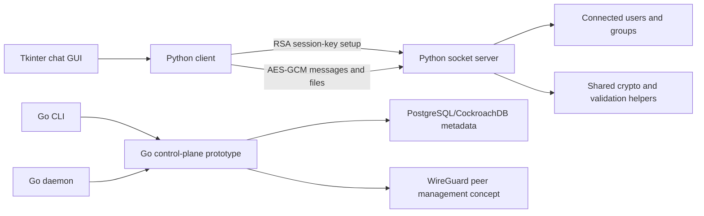

# GuardedIM Security Assessment Lab

[](https://github.com/NAMEisNOTvailable/guardedim-security-assessment/actions/workflows/smoke.yml)

GuardedIM is a runnable security review project for a small encrypted messaging system. It includes a Python chat client/server, encrypted message and file-transfer paths, and Go control-plane components for account, server, and network-management experiments.

The lab keeps two protocol-level weaknesses available for local testing, evidence collection, and mitigation mapping while keeping the scope on localhost review.

## What This Demonstrates

- Reviewed encrypted chat behaviour across key exchange, AES-GCM payload handling, message framing, and file transfer.
- Built localhost proof-of-concept demos for two protocol-level weaknesses.
- Hardened adjacent implementation risks, including sender spoofing, duplicate usernames, unsafe filenames, dangerous file extensions, and oversized frames.
- Python runtime tests plus Go compile/unit checks through GitHub Actions.

## Project Snapshot

| Area | Summary |
| --- | --- |
| Domain | Secure messaging security review and applied cryptography |
| Runnable target | Python socket service and Tkinter chat client with encrypted messages and file transfer |
| Main findings | Unauthenticated key exchange and handshake-framing desynchronisation |
| Evidence | Local demos, guided lab notes, mitigation write-ups, Python tests, and Go checks |
| Control components | Go CLI and daemon code for server/user management, database access, and WireGuard peer-update experiments |
| Data layer | CockroachDB/PostgreSQL-style metadata storage through Go `pgx` |
| Lab format | Safe localhost target with guided protocol-analysis challenges |

## Engineering Focus

- Built a Python socket server and Tkinter client for one-to-one chat, group chat, and file transfer.
- Implemented RSA session-key setup and AES-GCM encryption paths so the security issues can be tested in a real flow.
- Kept two intentionally vulnerable lab targets: unauthenticated key exchange and handshake protocol desynchronisation.
- Added hardening around sender identity, duplicate usernames, file handling, and encrypted-frame size limits.
- Maintained Go control-plane components for server setup, user registration, database access, and WireGuard peer-update experiments.

## Architecture at a Glance



See [Architecture Notes](docs/ARCHITECTURE.md) for the component map and design boundaries.

## Repository Structure

```text
client/      Python chat client and Go client-side setup helpers
server/      Python server prototype and Go server/database control helpers
common/      Shared Python encryption utilities
cmd/gdim/    Go CLI control commands
cmd/gdimd/   Go daemon entry point
docs/        Architecture notes and security findings
labs/        Guided vulnerable-lab challenges
demos/       Local proof-of-concept demos for the two lab findings
```

## Key Files

| Path | Purpose |
| --- | --- |
| `client/chat_gui.py` | Tkinter GUI for user chat interactions |
| `client/client.py` | Python client connection, encryption, message, group, and file-transfer logic |
| `server/server.py` | Python socket server, key exchange, message forwarding, and group handling |
| `common/encryption.py` | Shared AES-GCM and RSA helper functions |
| `cmd/gdim/` | Go command-line control surface |
| `cmd/gdimd/` | Go daemon entry point |
| `guarded_im_config.example.json` | Example configuration template |
| `.env.example` | Localhost Python prototype settings |
| `SECURITY_NOTES.md` | Security scope and review themes |
| `docs/FINDINGS.md` | Assessment finding matrix |
| `docs/MITIGATIONS.md` | Vulnerable design versus mitigation comparison |
| `labs/README.md` | Lab challenge index |
| `demos/README.md` | Local demo script index |

## 60-Second Verification

After installing the Python dependencies, run these checks from the repository root:

```bash
python -m unittest discover -s tests
python demos/run_all.py
go test ./...
```

The Python tests cover validation, runtime exchange, and sender binding. The demo runner reproduces the two local-only assessment findings. The Go check validates the control-plane packages when Go is available.

## Setup Notes

Install Python dependencies:

```bash
python -m venv .venv
. .venv/bin/activate
pip install -r requirements.txt
```

Create local configuration from the example:

```bash
cp guarded_im_config.example.json guarded_im_config.json
cp .env.example .env
```

Runtime keys are generated locally on first server start. To rotate them manually:

```bash
python -m server.server --gen-keys
```

Start the Python server and GUI client in separate terminals:

```bash
python -m server.server
python -m client.chat_gui
```

Build the Go control components when Go is available:

```bash
go build -o gdim ./cmd/gdim/*.go
go build -o gdimd ./cmd/gdimd/*.go
```

The Go code is kept as a control-plane prototype. It covers configuration parsing, database-backed server/user records, WireGuard peer setup paths, and the mTLS-oriented control server. Automated checks run lightweight Go unit and compile checks; a deployed system would require operational secret management, certificate lifecycle handling, and environment-specific service packaging.

## Lab Challenges

The lab is designed around two intentionally introduced protocol flaws:

| Challenge | Focus | Entry point |
| --- | --- | --- |
| 01 | Unauthenticated RSA key exchange and MITM reasoning | [`labs/challenge-01-unauthenticated-key-exchange.md`](labs/challenge-01-unauthenticated-key-exchange.md) |
| 02 | Handshake desynchronisation through inconsistent length handling | [`labs/challenge-02-handshake-desync.md`](labs/challenge-02-handshake-desync.md) |

Each challenge describes the target files, review goal, expected observation, and mitigation direction.

## Local Demo Scripts

The repository includes two local-only proof-of-concept demos. They bind to `127.0.0.1` or use in-process sockets and are intended for assessment discussion:

```bash
python demos/run_all.py
```

Run individual demos when reviewing one finding at a time:

```bash
python demos/mitm_key_replacement_demo.py
python demos/handshake_desync_demo.py
```

See [Local Vulnerability Demos](demos/README.md) for details.

## Security Review Focus

- Which issues are intentionally vulnerable lab targets for the assessment?
- How is server identity validated before accepting public keys?
- How are session keys generated, exchanged, stored, and rotated?
- How can message framing errors desynchronise an encrypted protocol?
- How should file-transfer payloads be validated and constrained?
- How should private keys, certificates, database credentials, and local configuration stay out of source control?
- Which risks are mitigated in the prototype, and which remain documented limitations?

See [Security Notes](SECURITY_NOTES.md), [Security Assessment Findings](docs/FINDINGS.md), [Mitigation Comparison](docs/MITIGATIONS.md), and [Architecture Notes](docs/ARCHITECTURE.md).

## Excluded Runtime Files

Generated or machine-specific files are excluded:

- `.env` and machine-specific configuration
- generated binaries
- generated private/public key material
- local certificates and database credentials
- screenshots and test media
- real deployment secrets

## License

Original source code and documentation are licensed under the MIT License.

## Status

Academic secure-programming prototype focused on security assessment and mitigation review.
