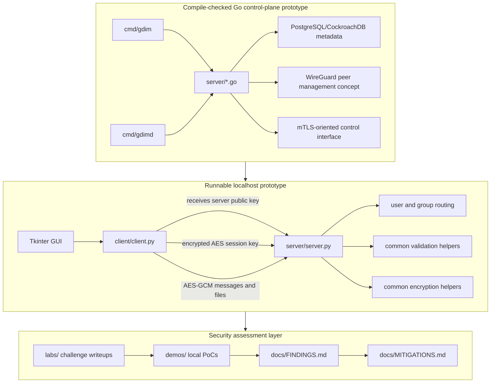

# Architecture Notes

GuardedIM combines a WireGuard-oriented connection layer, an AES-GCM/RSA application layer, Python chat components, and Go control components. The codebase is structured as an academic secure-programming assessment lab.

## Component Map

| Component | Language | Responsibility |
| --- | --- | --- |
| `client/chat_gui.py` | Python | Tkinter chat interface |
| `client/client.py` | Python | Client connection, encrypted message sending, file transfer, group messaging |
| `server/server.py` | Python | Socket server, RSA/AES-GCM key flow, message routing, group handling |
| `common/encryption.py` | Python | Shared encryption helpers |
| `cmd/gdim/` | Go | CLI commands for setup and server/user management |
| `cmd/gdimd/` | Go | Daemon entry point for server/client operational mode |
| `server/*.go` | Go | Database access, WireGuard interface setup, peer updates, and control server logic |

## Architecture Diagram

## Design Context

- The intended connection layer used WireGuard for server connectivity and peer management.
- The intended control plane used mTLS so only clients with CA-signed certificates could access control functionality.
- The application layer used per-session AES-GCM keys exchanged through RSA and tested through a localhost Python prototype.
- The localhost prototype enabled early one-to-one chat, group chat, and file-transfer testing before the full connection layer was complete.
- The Go control-plane code models database-backed server/user records, WireGuard peer updates, and service startup paths. It is included as a compile-checked prototype, not as a packaged production deployment.

## High-Level Flow

1. The Python server loads or generates RSA key material locally.
2. A client connects and receives the server public key.
3. The client generates an AES session key and sends it encrypted with RSA.
4. Messages and file payloads are encrypted with AES-GCM for the session.
5. The server forwards user, group, and file payloads to connected clients.
6. Go components model the operational layer for database-backed server/user management and WireGuard-oriented connectivity.

## Review Boundaries

The repository keeps source code and documentation while excluding generated secrets and deployment artifacts.

The repository is useful for reviewing:

- secure communication design decisions
- implementation-level security risks
- local secret handling expectations
- Go control-plane boundaries and deployment assumptions
- prototype limitations
- mitigation documentation quality

It should not be treated as a production-ready secure messenger.
